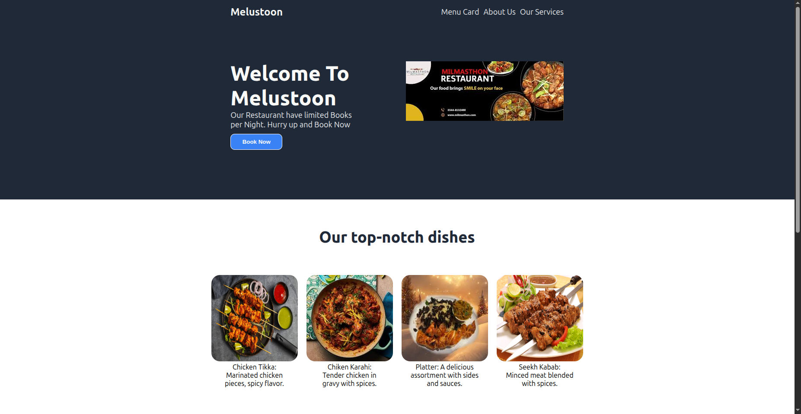
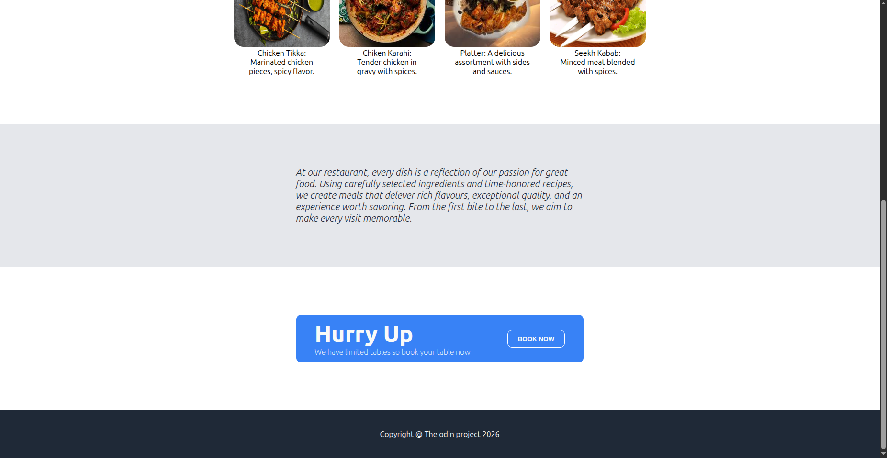

# Restaurant Landing Page
A modern restaurant landing page build with html, css.

## Website Preview



## About the project
This project is a modern restaurant landing page Which contain a hero section, special items, and also footer. The purpose of this project is to build real world skill with layout such as flexbox.

## Features
- Clean and simple restaurant landing page
- with hero section body and footer
- Flexable layout using flexbox

## Tech used
- HTML5
- CSS3 (flexbox)

## Installation

- clone the repository
   ```bash
   git clone 
Using ssh key or http etc

## What i learn
- Flexbox layout techniques
- Amazing possible ways to use Flexbox in real websites

## Author 
- Name: Umair khan
- GitHub: https://github.com/umairkhan819

## Credits
- Melmustoon facebook page
- pixals


